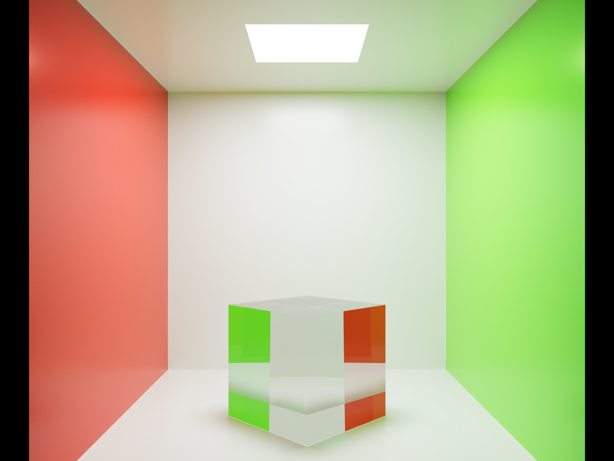
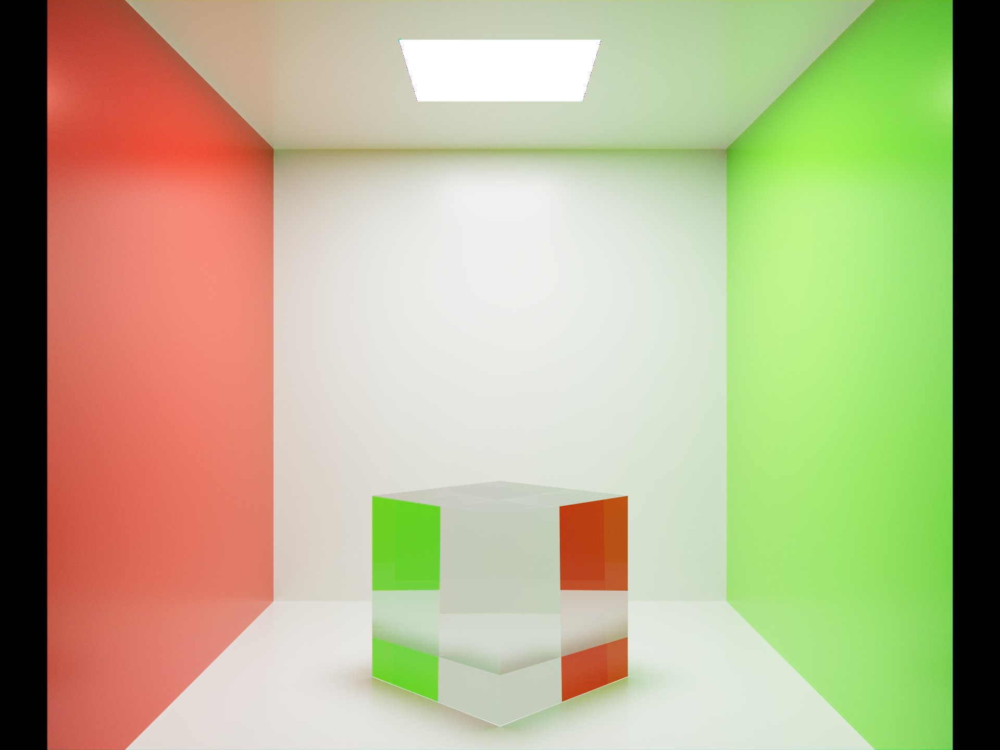

# Rust Path Tracer

This project is a GPU-accelerated path tracer written in Rust. It renders a simple scene and exports both tone-mapped PNG images and HDR AVIF variants.

## Prerequisites

- Rust toolchain (edition 2021).
- NVIDIA CUDA Toolkit and drivers. The build script uses `cmake` and `nvcc` to compile CUDA kernels.
- (Optional) NVIDIA OptiX for the `optix` feature flag.

## Building

```bash
cargo build
```

> **Note:** Building requires the CUDA toolkit. If the toolkit is not installed the build will fail during the `cmake` step.

## Running

Running the executable renders the scene and writes several images into the project root:

```bash
cargo run --release
```

## Outputs

| Image | Description |
|-------|-------------|
|  | Tone-mapped RGB output |
|  | Result after demosaicing the Bayer render |

Additional HDR versions are available as AVIF files:

- [HDR RGB](pt_pq.avif)
- [HDR Bayer](pt_bayer_pq.avif)

## License

This project is licensed under the terms specified in `LICENSE` (if present).
